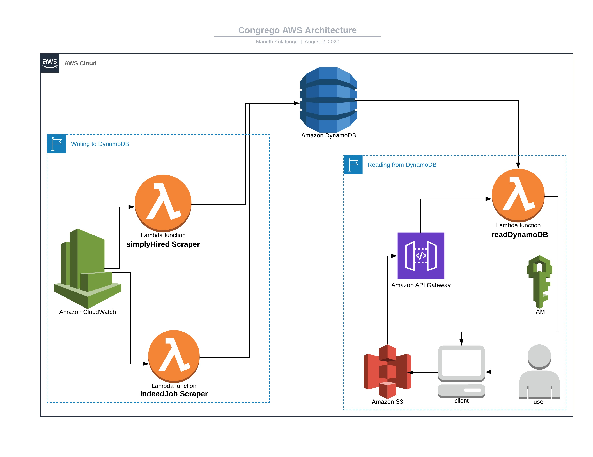

# congrego-JobScraper
Built an hourly job dashboard to assist individuals that lost their jobs due to the COVID-19 pandemic.

## Motivation
Canadians have lost over 2 millions jobs due to COVID-19 according to [CBC](https://www.cbc.ca/news/business/canada-jobs-april-1.5561001) and Quebec's [unemployment rate](https://www.cbc.ca/news/canada/montreal/quebec-record-job-losses-april-1.5561165) has rose to 17%(the highest ever recorded). I hope that this dashboard/platform will help individuals get back on their feet with hourly wage jobs that have been retrieved by 2 major job search sites in Canada. 

## Installation
```bash
* pip install bs4
* pip install requests
* pip install json
```
## AWS Architecture


There are two major sections for this AWS driven solution. One is to write data with regards to job postings to the NoSQL DynamoDB. The other section is to read details with regards to job postings from the populated DynamoDB. 

There are 2 write Lambdas with the code in the [Indeed Job Scraper](https://github.com/ManethKulatunge/congrego-JobScraper/blob/master/backEnd/indeedScraper.py) and the [Simply Hired Job Scraper](https://github.com/ManethKulatunge/congrego-JobScraper/blob/master/backEnd/simplyHiredScraper.py). These lambdas are scheduled by CloudWatch events and are triggered daily at 2pm EST (Cron Expression ```0 13 * * ? *```). The Lamdas write to the DynamoDB using JOB_ID as a primary key. Other details stored include Job Title,Location, Salary,Company, and the respective Website.

On the client side, the web application is hosted using a S3 bucket and makes a GET API Call to the read Lamda named [Read DynamoDB](https://github.com/ManethKulatunge/congrego-JobScraper/blob/master/backEnd/readDynamoDB.py). After retrieving the results from the DynamoDB, the web app uses [populateTables.js](https://github.com/ManethKulatunge/congrego-JobScraper/blob/master/frontEnd/js/populateTables.js) to dynamically generate rows of content related to the job list with the following columns: Job Title,Location, Salary,Company, and Website. 

## Note: Lambda Design
I have incoporated the external Python libraries to the Lambda as a layer. You can follow these steps to do the same.
1. Go to Lambda> Layers> Create Layer
2. Upload a zip file with the relevant Python packages using afore mentioned installation procedures
3. Choose Python 3.7 as a compatible runtime
4. Go back to Lambda function designer
5. Add Layer, choose the option of addition as AWS layer and indicate the layer you created with dependencies
6. Save and Run a test to validate the successful addition of libraries

## Front End Design (hosted on S3)


Further design code by HTML5UP can be found on this [repo](https://github.com/ManethKulatunge/congrego)

## Future Improvements
* More job search sites incorporated in the form of Write Lambdas
* A mobile responsive front end
* Addition of a Job Loss Graph
* Better UI/UX for the job listings (filters etc)
